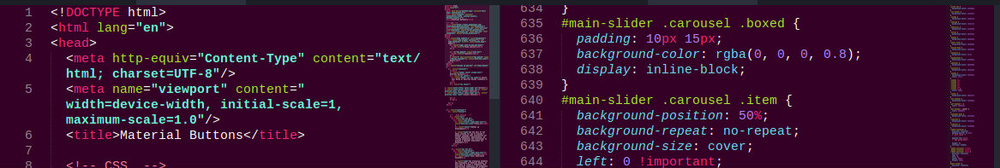

# Unicorn Paradise: a Sublime Theme Color

This is a Theme Color - made to use in **Sublime Text**, a famous editor for code.
You can know more about Sublime Text [here](https://www.sublimetext.com/).

## How it works

After installing, your Sublime Text should look like this. Then you can enjoy your new color scheme.

## How to install it

0. Download the UnicornParadise.tmTheme file here in this repo.
1. Open your Sublime Text.
2. Open your Package Folder in **Preferences> Browse Packages**

3. Copy the Unicorn.tmTheme file in the **Colorsublime-Themes** folder.
4. Open your Sublime window again.
5. Select the theme by going in **Preferences> Color Scheme> Colorsublime-Themes>** UnicornParadise.
6. Enjoy it!

## Reference and credits

You can also create your own theme. You can use (and post your project in) [ColorSublime](http://colorsublime.com/) or use [Monokai](http://tmtheme-editor.herokuapp.com/#!/editor/theme/Monokai), which I used to make this one. :)
